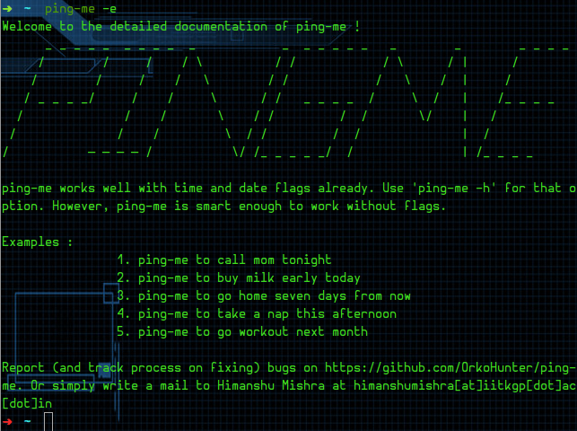

[](https://github.com/OrkoHunter/ping-me/tree/v0.2)
[](https://landscape.io/github/OrkoHunter/ping-me/master)
# ping-me
A Cross Platform personalized Ping

The beauty of `ping-me` is its command line interface. Get all of your
reminders done just by a single line command on your favorite terminal
screen. `ping-me` will *surely* ping you at that time, no matter you
are online or not. It will get to you on your phone device, smart watch
and even SMS in worst cases.

Stay Lazy, Stay Updated !



## Installation

__Current Release__ - [0.3](https://github.com/OrkoHunter/ping-me/tree/v0.2)

__Step 1 :__ Installing package and dependencies
```sh
$ pip install ping-me
```
Make sure all the dependencies get installed properly while the installation.

__Step 2 :__ Setting up cronjob (Not for windows, See step 3)
```sh
$ crontab -e
```
In the file, add the following lines
```
PATH=/usr/local/sbin:/usr/local/bin:/usr/sbin:/usr/bin:/sbin:/bin
DISPLAY=:0.0

* * * * * get-ping
```
_Make sure to leave a blank line at the end of the file._

Save and exit. The installation is complete.

_See [this](https://github.com/OrkoHunter/ping-me/pull/22#issue-122990856) for
some explanation of the crontab_

__Step 3 :__ Chrome Extension

Download the chrome extension from [here](https://chrome.google.com/webstore/detail/ping-me/blcdkjncblkniknjkkcmlbfddeemidap).

Log in with the credentials you used for ping-me. And we are done.

_Note : ping-me will work even if all chrome windows are closed._

## Usage

### Use of flags
```sh
$ ping-me -d November-24-2015 -t 14:30 Get up and eat!
```
By default `-d` and `-t` accounts for `datetime.today` and `00:00 hours`
respectively. Go ahead and make experiments with the syntax.

### No flags, pure language
```sh
$ ping-me to get up and eat tomorrow afternoon
```

_Add `-v` flag at the end to see the verbose output._

## Project Status
 - [X] `ping-me` identifies date, time and message using flags
 - [X] `ping-me` asks for configuration on first request
 - [X] `ping-me` stores the configuration on remote server
 - [X] `ping-me` stores the message with datetime stamp on the server
 - [X] Server activates the ping 50 seconds prior to its exact time
 - [X] Server ready for a GET request
 - [X] `ping-me` makes full use of natural language processing
 - [X] `ping-me` notifies through chrome/firefox extension
 - [X] `ping-me` works on linux
 - [X] `ping-me` works on windows
 - [X] `ping-me` works on OS X
 - [ ] `ping-me` works on Android
 - [ ] `ping-me` sends texts to phone
 - [ ] `ping-me` ping-me works on ios
 - [ ] `ping-me` works on Windows phone

__Contribution__ : Please feel free to report bugs in the application. I'll try to fix them. Also, if either of ~~javascript~~ or android is your piece of cake, please contact me and we'll make things up real quick. Enjoy anyways!
