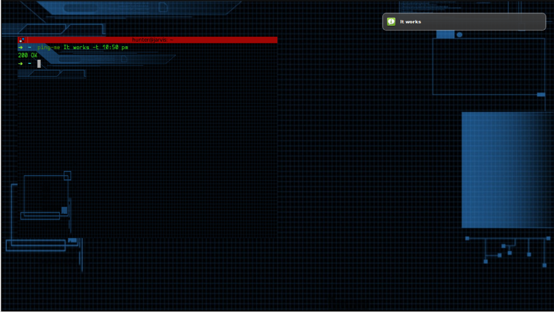

# ping-me
A Cross Platform personalized Ping

The beauty of `ping-me` is its command line interface. Get all of your
reminders done just by a single line command on your favorite terminal
screen. `ping-me` will *surely* ping you at that time on your desktop.

Stay Lazy, Stay Updated !

## Installation

```
$ pip install ping-me
```
Or
```
$ pip install https://github.com/OrkoHunter/ping-me/archive/v0.2.zip
```

This installs two scripts in your environment, `ping-me` and `get-ping`. The
first one is used to set the reminder and the later one notifies you. To
receive notifications, `get-ping` must be running as a daemon. So, fire the
script in the background as

```
$ nohup get-ping &
```

and we're done !

## Usage

Run, `ping-me config` for configurations. ping-me is ready to be tested now.

Let's try one. Right now the time is suppose `22:45 o' clock`

```
$ ping-me It works -t 10:50 PM
```


